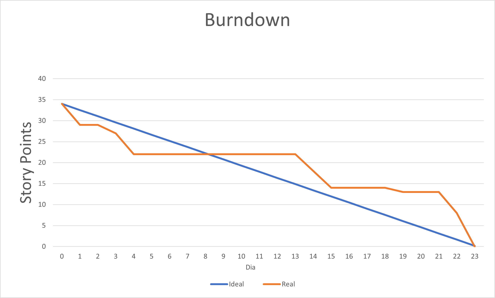
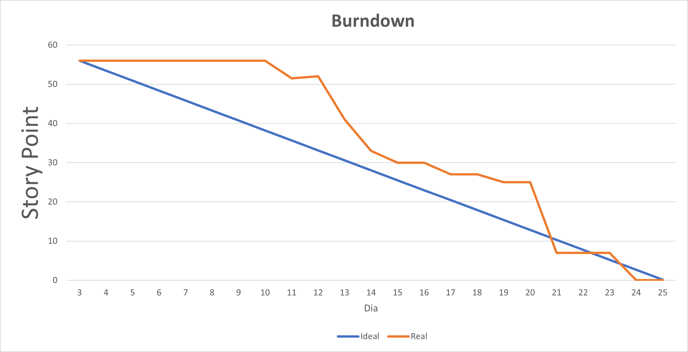
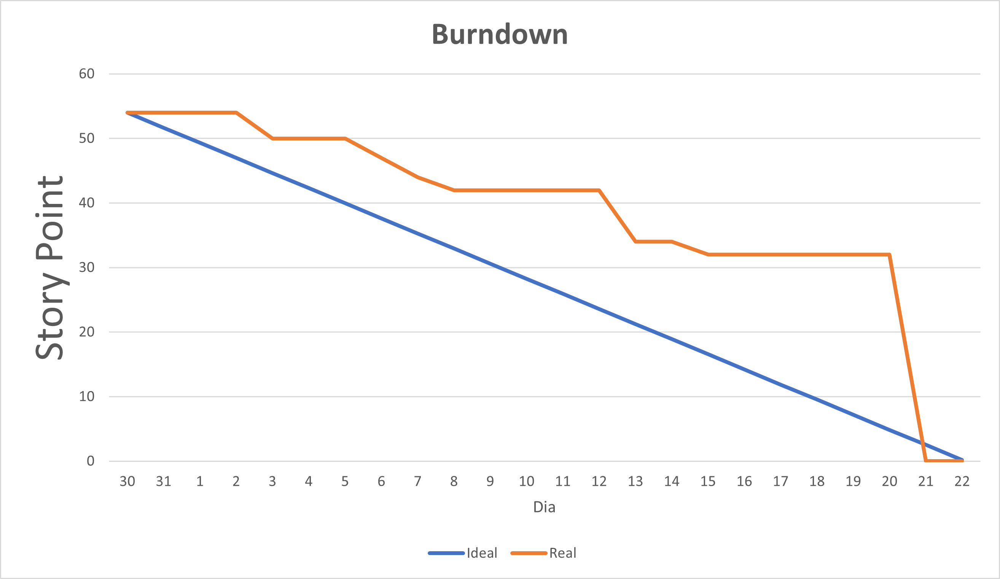

<h1 align ="center"> < / The Code / > </h1>

<h1 align="center">Fatec Professor Francisco Moura, Jacareí - 1º Semestre DSM 2023</h1>

    <a href ="#objetivo">Objetivo </a>|
    <a href="#sobre">Sobre</a> | 
    <a href="#entregas">Entregas</a> | 
    <a href="#backlogs">Backlogs</a> |  
    <a href="#tecnologias">Tecnologias</a> | 
    <a href="#equipe">Equipe</a>

## 📌 Objetivo do projeto
Conforme desafio apresentado pelo cliente, o desenvolvimento de uma aplicação Curso Scrum será a proposta como solução, alinhado com a metodologia ágil, trazendo valores e processos da aplicação de modo claro e sucinto.

<h2> Sobre o projeto </h2>

Projeto desenvolvido por alunos do 1º semestre do curso de Desenvolviento de Software Multiplatafora, da FATEC Prof Francisco Moura em Jacareí.   Consiste na criação de uma plataforma de curso simples para o aprendizado do SCRUM. Front-end desenvolvido em linguagem de marcação HTML e estilo CSS em conjunto com JavaScript, framework utilizado Bootstrap.
>Status do projeto: Em desenvolvimento :hourglass:

## Como executar a aplicação:

* Figma:<a href="https://www.figma.com/proto/WamIDDE9ZgLUanlkHOClT3/Untitled?type=design&node-id=1-2&t=JapPxWvDgM2Vw1s7-1&scaling=min-zoom&page-id=0%3A1&starting-point-node-id=1%3A2&hotspot-hints=0&mode=design">Clique Aqui!</a>
* Vídeo Sprint 1:<a href="https://www.youtube.com/watch?v=ZdZHI50Kp0w">Clique aqui!</a>
* Vídeo Sprint 2:<a href="https://www.youtube.com/watch?v=mlz_nk9haQA">Clique aqui!</a>
* Vídeo Sprint 3:<a href="https://youtu.be/5ee_bg_fomc">Clique aqui!</a>
* Aplicação/Site:<a href="https://team-the-code.github.io/EquipeTheCode.github.io/">Clique aqui!</a>

##  🎯 Entregas
O projeto está sendo realizado utilizando-se da metodologia ágil SCRUM, separadas em 3 entregas com sprints de 23 dias de duração cada uma.  

| Sprint| Período | Status |
|:-----:|:----------:|:---------:|

| 01 |   04/09/2023 – 27/09/2023 | <a href="#sprint_1">Entrega</a> :heavy_check_mark: | 
| 02 |   02/10/2022 - 25/10/2023 | <a href="#sprint_2">Entrega</a> :heavy_check_mark:|    
| 03 |   30/10/2022 - 22/11/2023 | <a href="#sprint_3">Pendente</a> :heavy_check_mark:| 

###   Backlogs
#### Backlog do produto

| Requisito | Sprint |
| :----------------------------------|:--:|
|**1.Apresentação via GitHub**  | 2 |
|**2.Sistema deve ser limpo e sem poluição de informação**  | 2 |
|**3.Criar um Sistema de Avaliação**| 2 |
|**4.Processo Scrum** | 2 |
|**5.Burndown** | 2 |
|**6.Product Backlog**| 2 |
|**7.Sprint Backlog** | 2 |
|**8.Sprint**|2|
|**9.Sprint Planning**| 2 |  
|**10.Sprint Review**| 2 |
|**11.Daily**|3|
|**12.Retrospectiva**|3|
|**13.DOR**|3|
|**14.DOD**|3|
|**15.Planning Poker**|2|
|**16.Kanban**|3|
|**17.Artefato Scrum**|3|
|**18.MVP**|2|
|**19.Protótipo**|1|

#### User Story

|**Requistos**|**User Story**|
|:----------------:|:-------------------------------------:|
|**1.Apresentação via GitHub**|**Como equipe, quero apresentar o curso scrum pelo github, para melhor experiência dos usuários.**|
|**2.Sistema deve ser limpo e sem poluição de informação**|**Como usuário, preciso acessar com facilidade o site, para melhor experiência**|
|**3.Criar um Sistema de Avaliação**|**Como usuário, quero acessar as atividades, para testar conhecimento**|
||**Tela de Início**|
|**2.Sistema deve ser limpo e sem poluição de informação**|**Como usuário, quero ter acessar um site com informações claras, para melhor experiência;**|
|**2.Sistema deve ser limpo e sem poluição de informação**|**Como usuário, eu quero acessar a tela de início, para entrar no curso;**|
|**2.Sistema deve ser limpo e sem poluição de informação**|**Como usuário, eu quero acessar a tela de sobre, para ter acesso a informações da empresa;**|
|**2.Sistema deve ser limpo e sem poluição de informação**|**Como usuário, eu quero acessar a tela de contato, para ter acesso a informações da equipe;**|
||**Tela do Ciclo 1**|
|**Introdução**|**Como usuário, eu quero acessar a tela do ciclo 1, para aprender história Scrum;**|
|**Introdução**|**Como usuário, eu quero acessar a tela do ciclo 1, para aprender metodologia ágil;**|
|**Funções Scrum**|**Como usuário, eu quero acessar a tela do ciclo 1, para aprender funções do Scrum;**|
|**6.Product Backlog**|**Como usuário, eu quero acessar a tela do ciclo 1, para aprender o processo do backlog;**|
|**19.MVP**|**Como usuário, eu quero acessar a tela do ciclo 1, para aprender o processo do Mínimo Produto Viável;**|
||**Tela do Ciclo 2**|
|**8.Sprint**|**Como usuário, eu preciso acessar a tela do ciclo 2, para aprender Sprint;**|
|**4.Processo Scrum**|**Como usuário, eu preciso acessar a tela do ciclo 2, para aprender Processos Scrum;**|
|**9.Sprint Planning**|**Como usuário, eu preciso acessar a tela do ciclo 2, para aprender Sprint Planning;**|
|**7.Sprint Backlog**|**Como usuário, eu preciso acessar a tela do ciclo 2, para aprender Sprint Backlog;**|
|**16.Planning Poker**|**Como usuário, eu preciso acessar a tela do ciclo 2, para aprender Planning Poker;**|
|**11.Daily**|**Como usuário, eu preciso acessar a tela do ciclo 2, para aprender Daily;**|
|**10.Sprint Review**|**Como usuário, eu preciso acessar a tela do ciclo 2, para aprender Sprint Review;**|
|**5.Burndown**|**Como usuário, eu preciso acessar a tela do ciclo 2, para aprender Burndown;**|
||**Telo do Ciclo 3**|
|**17.Artefatos Scrum**|**Como usuário, eu tenho em vista acessar a tela do ciclo 3, para aprender Artefatos Scrum;**|
|**6.Product Backlog**|**Como usuário, eu tenho em vista acessar a tela do ciclo 3, para aprender Product Backlog;**|
|**16.Kanban**|**Como usuário, eu tenho em vista acessar a tela do ciclo 3, para aprender o quadro Kanban;**|
|**13.DOR**|**Como usuário, eu tenho em vista acessar a tela do ciclo 3, para aprender DOD;**|
|**14.DOD**|**Como usuário, eu tenho em vista acessar a tela do ciclo 3, para aprender DOR;**|
|**12.Retrospectiva**|**Como usuário, eu tenho em vista acessar a tela do ciclo 3, para aprender Sprint Retrospective;**|
||**Atividades entre Ciclo**|
|**3.Criar um Sistema de Avaliação**|**Como usuário, eu quero acessar as atividades do ciclo 1, para assimilar Definição do Scrum;**|
|**3.Criar um Sistema de Avaliação**|**Como usuário, eu quero acessar as atividades do ciclo 2, para assimilar Valores Scrum;**|
|**3.Criar um Sistema de Avaliação**|**Como usuário, eu quero acessar as atividades do ciclo 3, para assimilar Artefato Scrum;**|
|**3.Criar um Sistema de Avaliação**|**Como usuário, eu quero acessar as atividades do ciclo 3, para assimilar Artefato Scrum;**|
||**Protótipo**|
|**19.Protótipo**|**Como cliente, eu quero acessar o Figma, para ter acesso ao protótipo;**|
 

### Backlog das sprints

 

### Sprint 1
| Item | Funcionalidade                  |
| :--: | :-------------------------: |
|  01  | **WireFrame da Aplicação**| 

### Tarefas na Sprint 

|   Tarefas  |         Story Point         |
|:-------------------------:|:-----:|
| **Pesquisa de conteúdo SCRUM**| 02 |
| **WireFrame no Figma**| 05 |
|**Planning Poker**| 01 |
|**Logo da empresa** | 05 |
| **Marca do Time** | 04 |
| **Jira** | 04 |
| **Análise de coloração**| 01 |
| **Documentação no GitHub** | 05 |
| **Backlog** | 05 |
| **Fazer a apresentação** | 02 |
|||
|   **Total Story Point** | 34|
 

### Quadro Kanban Sprint 1

|  Product Backlog  |   Sprint Backlog (Tarefas com base no requisito 19)  |   A fazer    |     Em andamento     |     Pronto    | Membro |
|:----------------:|:-------------------------------------:|:-------:|:---------------------:|:----------------:|:----------------:|
| **19 - WireFrame no Figma**  |  WireFrame no Figma|                  |                   |X|Todos os membros|
| * |Pesquisa do Conteúdo Scrum|                  |                   |X| Edlaine, Lucas, Samuel|
| * |Planning Poker|                 |                   |X| Todos os membros|
| * |Marca do empresa|                  |                   |X| Ana Júlia, Marcelly, Vitor|
| * |Marca do time|                |                   |X| Ana Júlia, Anielle, Marcelly, Vitor|
| * |Jira|                  |                   |X| Samuel|
| * |Análise de coloração|                  |                   |X| Diogo, Paulo|
| * |Backlog|                  |                   |X|Paulo, Samuel|
| * |Fazer a apresentação|                  |                   |X|Samuel|
| * |Documentação via GitHub Sprint 1|                  |                   |X|Samuel|

<a href="https://github.com/users/Team-The-Code/projects/6/views/1?filterQuery=sprint%3A%22Sprint+1%22">Acesso ao Quadro Kanban</a>
 

## Métrica do Time

<a href="https://fatecspgov-my.sharepoint.com/:x:/g/personal/samuel_melo01_fatec_sp_gov_br/EdaOzGv42etEobBS_tVXclcBUppPU8fuM0YsYYENf8jjag?e=hHKZby">Acesso</a>

 

## Retrospectiva da Sprint 1
|O que funcionou bem| O que poderia melhorar|
|:-----------------:|:---------------------:|
| **Wireframe;**|**Comunicação entre os membros;**|
|**Daily;** |**Mais informações sobre a API;**|
|**Direcionamento Final.**|**Planejamento;** |
|                   |**Direcionamento inicial.**|

 

 
 

### Sprint 2 
| Item | Funcionalidade             |
| :--: | :------------------------------------------------------- |
|  01  |**1.Apresentação via GitHub**   |
|  02  |**2.Sistema deve ser limpo e sem poluição de informação**|
|  03  |**3.Criar um Sistema de Avaliação**|
|  04  |**4.Processo Scrum**|
|  05  |**5.Burndown**|
|  06  |**6.Product Backlog**|
|  07  |**8.Sprint** |
|  08  |**9.Sprint Planning**|
|  09  |**10.Sprint Review**|
|  10  |**15.Planning Poker**|
|  11  |**18.MVP**|

### Tarefas na Sprint 
|   Tarefas  |         Story Point         |
:-------------------------:|:-----:|
| **Desenvolver um Sistema deve ser limpo e sem poluição de informação**| 0 |
| **Conteúdo do Processo SCRUM**| 03 |
|**Conteúdo do Planning Poker**| 02 |
|**Página de Início** | 02 |
| **Página de Sobre** | 03 |
| **Página de Contato** | 02 |
| **Layout página dos Ciclos 1,2 e 3**| 03 |
| **Criar um Sistema de Avaliação** | 05 |
| **Conteúdo de Cargos/Funções no SCRUM** | 03 |
| **História SCRUM** | 02 |
| **Metodologia Ágil** | 03 |
| **Conteúdo sobre definição de Sprint** | 02 |
| **Conteúdo MVP** | 02 |
| **Conteúdo Product Backlog** | 08 |
| **Conteúdo Sprint Planning** | 02 |
| **Apresentação via GitHub** | 05 |
| **Conteúdo Sprint Backlog** | 03 |
| **Conteúdo Sprint Review** | 03 |
| **Conteúdo do Burndown** | 03 |
|||
|   **Total Story Point** | 56|

### Quadro Kanban Sprint 2

|  Product Backlog  |   Sprint Backlog 2 (tarefas)|   A fazer   |     Em andamento    |     Pronto    | Membro |
|:----------------:|:-------------------------------------:|:-------:|:---------------------:|:----------------:|:----------------:|
|**1.Apresentação via GitHub**|**Desenvolver um Sistema deve ser limpo e sem poluição de informação**|||X|Todos os Membros|
|**2.Sistema deve ser limpo e sem poluição de informação**|**Conteúdo do Processo SCRUM**|||X|Vitor|
|**3.Criar um Sistema de Avaliação**|**Conteúdo do Planning Poker**|||X|Samuel|
|**4.Processo Scrum**| **Página de Início** |||X|Marcelly|
|**5.Burndown**|**Página de Sobre** |||X|Lucas|
|**6.Product Backlog**|**Página de Contato**|||X|Anniele|
|**9.Sprint Planning**|**Layout página dos Ciclos 1,2 e 3**|||X|Ana Júlia, Edlaine, Marcelly, Samuel|
|**10.Sprint Backlog**|**Conteúdo de Cargos/Funções no SCRUM**|||X|Vitor|
|**11.Sprint Review**|**História SCRUM**|||X|Ana Júlia|
|**12.Dayli**  |**Metodologia Ágil**|||X|Ana Júlia|
|**16.Planning Poker**|**MVP**|||X|Paulo|
|**19.MVP**|**Conteúdo sobre definição de Sprint**|||X|Marcelly|
||**Conteúdo Product Backlog**|||X|Samuel|
||**Conteúdo Sprint Planning**|||X|Samuel|
||**Apresentação via GitHub**|||X|Samuel|
||**Conteúdo Sprint Backlog**|||X|Samuel|
||**Conteúdo Sprint Review**|||X|Anielle|
||**Criar um sistema de avaliação**|||X|Samuel|
||**Conteúdo do Burndown**|||X|Anielle|

<a href="https://github.com/users/Team-The-Code/projects/6/views/1">Acesso ao Quadro Kanban</a>

## Métrica do Time

<a href="https://fatecspgov-my.sharepoint.com/:x:/g/personal/samuel_melo01_fatec_sp_gov_br/EYnohnRVS1RElEp5XfIx-g0BqAQGv49jlyUkXVcIENBtTw?e=tjrOJV">Acesso</a>

 

## Retrospectiva da Sprint 2
|O que funcionou bem| O que poderia melhorar|
|:-----------------:|:---------------------:|
| **Apresentação do Trabalho;**|**Organização para todos apresentar;**|
|**GitHub da equipe, todos commitaram;** |**Planejamento nas tarefas;**|
|**Interação de todos da equipe com o Produto;**|**Pouca conversa com o cliente;** |
|                   |**Direcionamento de trabalho na aplicação.**|

 

 

### Sprint 3 
| Item | Funcionalidade             |
| :--: | :------------------------------------------------------- |
|  01  | **11.Kanban** |
|  02  | **12.Retrospectiva**|
|  03  | **13.DOR**|
|  04  |  **14.DOD**|
|  05  | **17.Artefato Scrum**|

### Tarefas na Sprint 
|   Tarefas  |         Story Point         |
:-------------------------:|:-----:|
| **Conteúdo da Dor - Definition of Ready**| 02 |
| **Responsividade do Ciclos**| 08 |
|**Conteúdo da tela de diploma**| 08 |
|**Conteúdo da DOD - Definition of Done** | 02 |
| **Conteúdos das perguntas da atividade de cada ciclo** | 08 |
| **Formatar as funções no ciclo 1 em tópicos de acordo com o guia do scrum** | 03 |
| **Responsividade da tela de inicio, sobre. contato**| 08 |
| **Organizar o conteúdos dos ciclos entre historia, valores, artefatos e eventos** | 03 |
| **Conteúdo da Sprint Retrospective** | 02 |
| **Conteúdo do Kanban** | 02 |
| **Responsividade da tela atividade** | 08 |
|||
|   **Total Story Point** | 54|

### Quadro Kanban Sprint 3

|  Product Backlog  |   Sprint Backlog 2 (tarefas)|   A fazer   |     Em andamento    |     Pronto    | Membro |
|:----------------:|:-------------------------------------:|:-------:|:---------------------:|:----------------:|:----------------:|
|**11.Kanban** |**Conteúdo da Dor - Definition of Ready**|||X|Ana Júlia|
|**12.Retrospectiva**|**Responsividade do Ciclos**|||X|Ana Júlia, Marcelly, Samuel|
|**13.DOR**|**Conteúdo da tela de diploma**|||X|Vitor|
|**14.DOD**|**Conteúdo da DOD - Definition of Done** |||X|Ana Júlia|
|**17.Artefato Scrum** |**Conteúdos das perguntas da atividade de cada ciclo** |||X|Anniele, Edlaine Paulo, Samuel, Vitor|
||**Formatar as funções no ciclo 1 em tópicos de acordo com o guia do scrum**|||X|Ana Júlia|
||**Responsividade da tela de inicio, sobre. contato**|||X|Todos|
||**Organizar o conteúdos dos ciclos entre historia, valores, artefatos e eventos**|||X|Ana Júlia|
||**Conteúdo da Sprint Retrospective**|||X|Marcelly|
||**Conteúdo do Kanban** |||X|Samuel|
||**Responsividade da tela atividade**|||X|Ana Júlia, Marcelly, Samuel|

<a href="https://github.com/users/Team-The-Code/projects/6/views/1?filterQuery=sprint%3A%22Sprint+3%22">Acesso ao Quadro Kanban</a>

## Métrica do Time

<a href="https://fatecspgov-my.sharepoint.com/:x:/g/personal/samuel_melo01_fatec_sp_gov_br/Eey-tjEKc9BIlYugK0xDlKgBN6Z2irxXh-NcbSCo6Rq7DA?e=SSjwed">Acesso</a>
 

## Retrospectiva da Sprint 3
|O que funcionou bem| O que poderia melhorar|
|:-----------------:|:---------------------:|
|Comunicação da equipe|Baixa frequência da Daily|
|Tempo de entrega das tarefas|Pouco acesso ao cliente|
|Comprometimento do time com as atribuições||

 

 

## Sprint Review
|Conclusões| 
|:-----------------:|
|O produto cumpriu com as demandas do cliente||
|A cooperação da equipe entregando todas as atribuições impostas em todas as sprints|
|Bom relacionamento por parte do time|
|Desenvoltura da equipe mesmo lidando com a perda de alguns membros|

 

 

## Tecnologias utilizadas
*    
* 
* 
* 
* 
* 
* 

## Equipe

|    Função   |  Nome    |    GitHub     |
| :----------: | :-----------------------|:------------------------------------------: |
|   Product Owner| Paulo Alexandre Bueno|[Github](https://github.com/pauloabueno23)|
|   Scrum Master| Samuel Lucas Vieira de Melo|[GitHub](https://github.com/SamuelLucasVieira)|
|   Dev Team| Ana Júlia Tette Lopes Afonso |[GitHub](https://github.com/AnaBarbancho)|
|   Dev Team| Anielle Wesla Macedo Xavier |[GitHub](https://github.com/Anielle-Ws)|
|   Dev Team| Edlaine de Paula Souza |[GitHub](https://github.com/edlaine-souza)|
|   Dev Team|  Marcelly Cristini Santos de Souza|[GitHub](https://github.com/Marcelly-cris)|
|   Dev Team|Vitor Cezar de Souza|[GitHub](https://github.com/vooshybee)|
